<div align="center">

# 🚀 USB-AI

### *Your Portable, Offline AI Assistant*

[](https://python.org)
[](LICENSE)
[](https://www.microsoft.com/windows)
[](.)
[](.)

<br>

> 🔒 **Privacy-First** • 🌐 **No Internet Required** • ⚡ **Instant AI Access**

---

### 🎬 Demo Video

<a href="./demo.mp4">
  
</a>

*See USB-AI in action! Click the button above or [download demo.mp4](./demo.mp4) directly.*

---

</div>

## 💡 The Unique Idea

**USB-AI** revolutionizes how we interact with AI by making it **truly portable and completely offline**. Unlike cloud-based AI assistants that require constant internet connectivity and raise privacy concerns, USB-AI:

<div align="center">

| 🎯 **Problem** | ✅ **USB-AI Solution** |
|:---:|:---:|
| Cloud AI needs internet | Works 100% offline |
| Data privacy concerns | Your data never leaves your device |
| Need software installation | Plug-and-play from USB |
| Expensive API subscriptions | One-time setup, free forever |
| Platform locked | Portable across any Windows PC |

</div>

### 🌟 Why USB-AI is Different

```
🔌 Just Plug → ▶️ Run → 🤖 AI Ready!
```

Imagine carrying your personal AI assistant in your pocket! Whether you're:
- 📚 A student working on assignments offline
- 💼 A professional needing AI help without corporate network restrictions  
- 🔐 Privacy-conscious users who want AI without cloud data collection
- 🌍 Travelers who need AI assistance without WiFi

**USB-AI has you covered!**

---

## ✨ Features at a Glance

<div align="center">

| Feature | Description |
|:---:|:---|
| 🔒 **Offline Operation** | Complete AI functionality without internet |
| 🎨 **Multiple Interfaces** | CLI, GUI, and Voice interfaces |
| 🧮 **Math Evaluation** | Solve complex mathematical expressions |
| 💻 **Code Assistant** | Generate and debug code |
| 🛡️ **Secure Authentication** | PIN-based security system |
| ⚡ **Memory Efficient** | Optimized for 8GB+ RAM systems |
| 🔄 **Hot Model Switching** | Switch between AI models seamlessly |

</div>

### 🎛️ Interface Options

<table align="center">
<tr>
<td align="center" width="33%">

#### 🖥️ GUI
*Recommended*

Modern graphical interface with chat-like experience

</td>
<td align="center" width="33%">

#### ⌨️ CLI
*Power Users*

Command-line interface for quick interactions

</td>
<td align="center" width="33%">

#### 🎤 Voice
*Hands-Free*

Voice-activated AI assistant

</td>
</tr>
</table>

---

## 📊 Current Model Status

<div align="center">

| Model | Status | Recommended |
|:---:|:---:|:---:|
| **Gemma-3-1B-IT** | ✅ Fully Operational | ⭐ **Yes** |
| TinyLLaMA | 🔧 Under Development | ❌ |
| DeepSeek-Coder-6.7B | 🔧 Under Development | ❌ |

</div>

> ⚠️ **Important**: Currently, only **Gemma-3-1B-IT** is fully functional and recommended for use.

---

## 🚀 Quick Start

```mermaid
graph LR
    A[🔌 Insert USB] --> B[▶️ Run Launcher]
    B --> C[🎯 Select Interface]
    C --> D[🤖 Start Chatting!]
    style A fill:#e1f5fe
    style B fill:#fff3e0
    style C fill:#f3e5f5
    style D fill:#e8f5e9
```

<div align="center">



</div>

### Step-by-Step Setup

1️⃣ **Insert** the USB drive (mounts as E:)

2️⃣ **Run** the launcher:
```bash
python usb_ai_launcher.py
```

3️⃣ **Choose** your interface:
- 🖥️ GUI (Recommended)
- ⌨️ CLI
- 🎤 Voice

---

## 💻 System Requirements

<div align="center">

| Component | Minimum | Recommended |
|:---:|:---:|:---:|
| 💾 **RAM** | 8GB | 16GB+ |
| 💽 **Storage** | 10GB | 20GB+ |
| 🐍 **Python** | 3.8+ | 3.13 |
| 🖥️ **OS** | Windows 10 | Windows 11 |
| 🎮 **GPU** | Optional | CUDA-compatible |

</div>

---

## 📦 Installation

```bash
# 1. Clone the repository
git clone <repository-url>

# 2. Navigate to directory
cd USBAI-test

# 3. Install dependencies
pip install -r requirements.txt

# 4. Launch USB-AI
python usb_ai_launcher.py
```

---

## 🎮 Usage

### 🖥️ GUI Interface (Recommended)
```bash
python usb_ai_launcher.py --interface gui
```

### ⌨️ CLI Interface
```bash
python usb_ai_launcher.py --interface cli
```

### 🎤 Voice Interface
```bash
python usb_ai_launcher.py --interface voice
```

---

## 🏗️ Architecture Overview

```
USB-AI/
├── 🚀 usb_ai_launcher.py    # Main launcher
├── 🧠 ai_engine.py          # AI processing engine
├── 🛡️ security.py           # Security module
├── 📁 models/               # AI models storage
├── 🎨 ui/                   # Interface components
│   ├── gui.py               # Graphical interface
│   ├── cli.py               # Command line interface
│   └── voice.py             # Voice interface
├── 📁 src/                  # Source utilities
└── ⚙️ config/               # Configuration files
```

---

## 🔧 Troubleshooting

<details>
<summary>🚨 Model loading issues</summary>

Ensure you're using the Gemma-3-1B-IT model (currently the only fully functional model)

</details>

<details>
<summary>💾 Memory issues</summary>

- Close unnecessary applications
- Run on a system with 16GB+ RAM for optimal performance

</details>

<details>
<summary>📋 Check logs</summary>

View detailed error information in the `logs/` folder

</details>

---

<div align="center">

## 🤝 Contributing

We welcome contributions! Feel free to submit issues and pull requests.

---

## 📄 License

This project is licensed under the MIT License.

---

### Made with ❤️ by the USB-AI Team

**⭐ Star this repo if you find it useful!**

</div>
