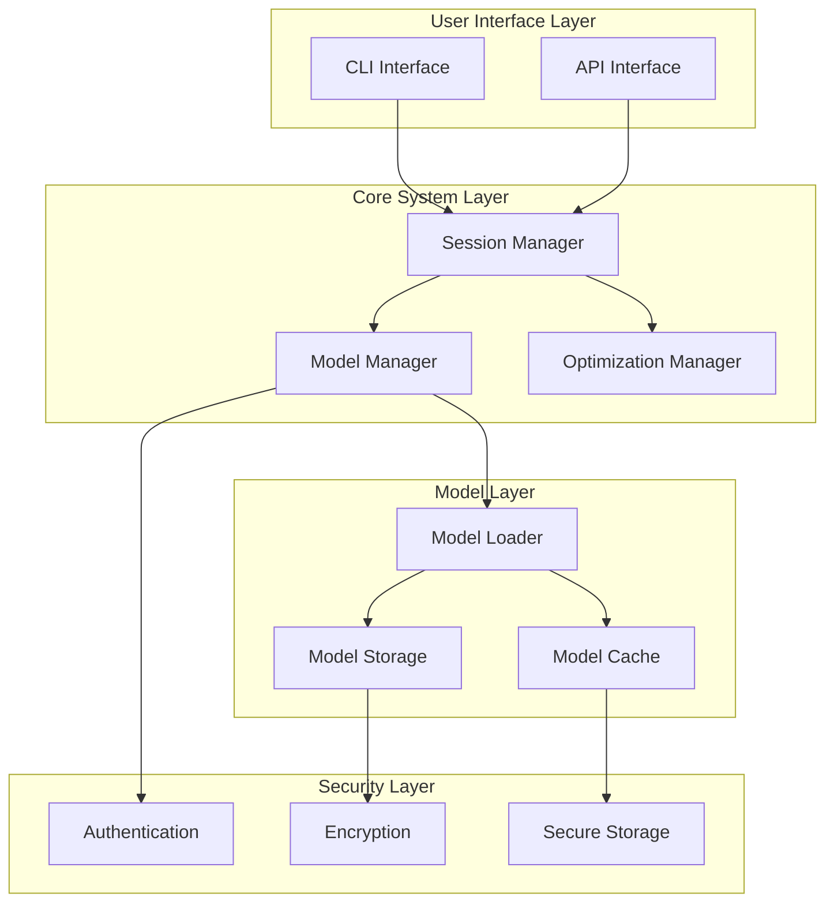
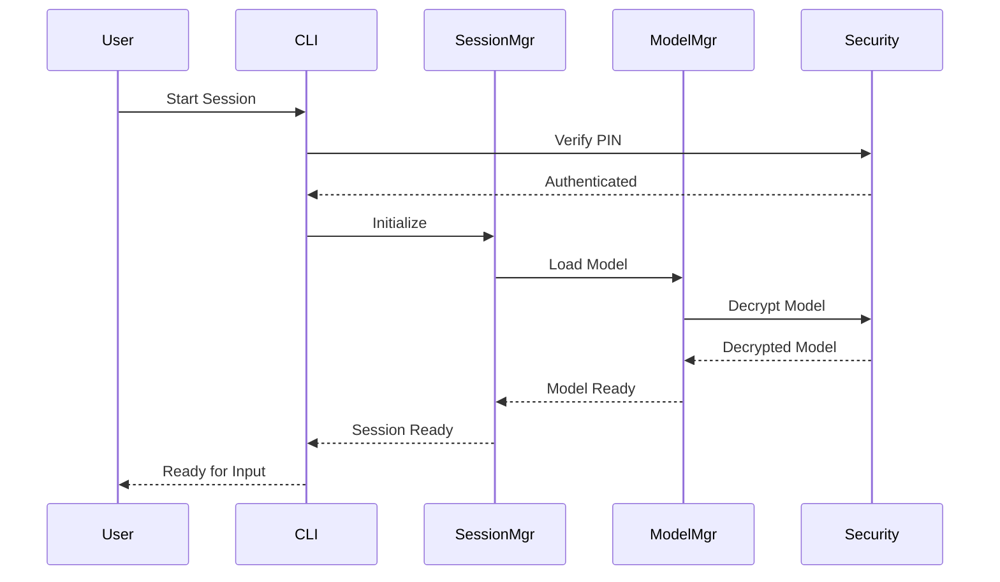
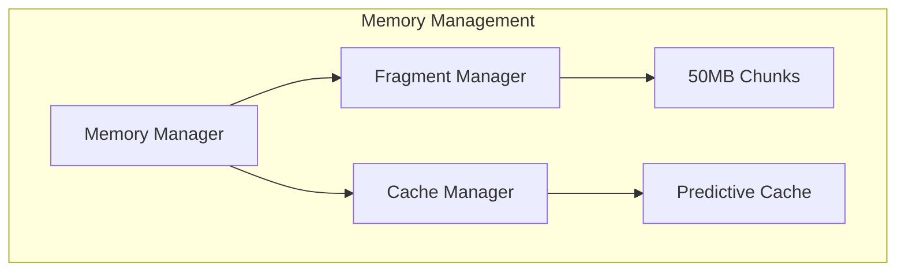
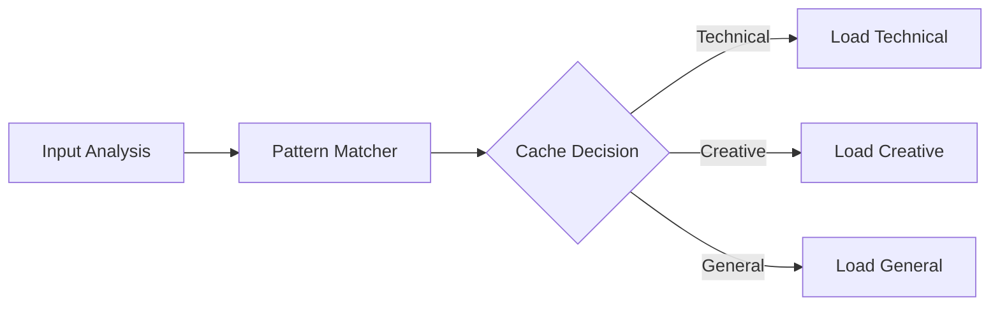
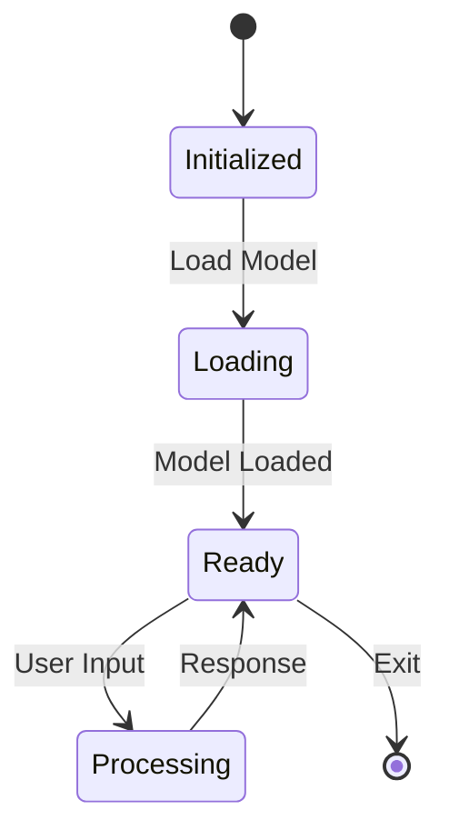
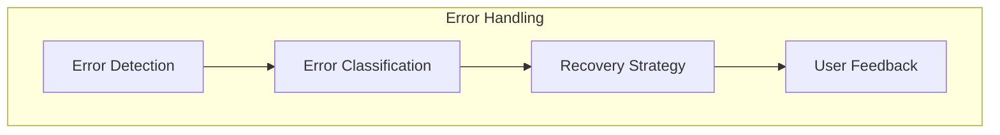
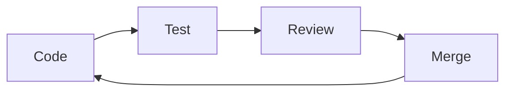

# USB-AI Technical Documentation
**Version 1.0.0**
May 23, 2025

## Table of Contents
1. [Executive Summary](#1-executive-summary)
2. [Current Model Status](#2-current-model-status)
3. [System Architecture](#3-system-architecture)
4. [Core Components](#4-core-components)
5. [Technical Implementation](#5-technical-implementation)
6. [Development Guide](#6-development-guide)
7. [Testing & Deployment](#7-testing--deployment)

## 1. Executive Summary

### 1.1 Project Overview
USB-AI is a revolutionary offline AI assistant that runs entirely from a USB drive, providing portable and secure AI capabilities. The system operates without internet connectivity, ensuring complete privacy and data security.

### 1.2 Key Features
- **Offline Operation**: Runs completely offline from a USB drive
- **Privacy-Focused**: No data leaves the device
- **Portable**: Works on any compatible Windows system (future support for macOS/Linux)
- **Resource-Efficient**: Sub-second responses on systems with 8GB RAM
- **Secure**: Advanced authentication and data protection

### 1.3 Technical Innovation
1. **Advanced AI Engine (ai_engine2.py)**
   - Optimized model loading and inference
   - Mathematical expression evaluation
   - Context-aware response generation
   - Memory-efficient operations

2. **Multi-Interface Support**
   - Command Line Interface (CLI)
   - Graphical User Interface (GUI)
   - Voice Interface with speech recognition

## 2. Current Model Status

⚠️ **Important Implementation Notice**: As of May 23, 2025, the USB-AI system has varying levels of model support.

### 2.1 Fully Functional Models
- ✅ **Gemma-3-1B-IT** - Complete implementation and testing
  - Location: `models/gemma-3-1b-it/`
  - Status: Production ready
  - Performance: Optimized for 8GB+ RAM systems
  - Features: Full conversation, math evaluation, code assistance

### 2.2 Models Under Development
- 🔧 **TinyLLaMA** - Partial implementation
  - Location: `models/tinyllama/`
  - Status: Legacy support, not fully functional
  - Issues: Model loading and tokenization problems

- 🔧 **DeepSeek-Coder-6.7B** - Early development
  - Location: `models/deepseek-coder-6.7b-instruct/`
  - Status: Model files present, integration incomplete
  - Target: Specialized code generation tasks

### 2.3 Recommended Usage
**For Production Use**: Only use the **Gemma-3-1B-IT** model until other models are fully implemented and tested.

**Development/Testing**: Other models can be used for development purposes but may produce inconsistent results.

## 3. System Architecture

### 3.1 High-Level Architecture


### 3.2 Component Interaction


## 4. Core Components

### 4.1 UAMF Specification

#### Structure
```
models/
├── config.json      # Model configuration
├── weights.bin      # Model weights
├── tokenizer.json   # Tokenizer configuration
└── metadata.json    # Model metadata
```

#### config.json Schema
```json
{
    "model_type": "transformer",
    "architecture": {
        "hidden_size": 4096,
        "num_attention_heads": 32,
        "num_hidden_layers": 32,
        "intermediate_size": 11008,
        "max_position_embeddings": 4096,
        "vocab_size": 32000
    },
    "quantization": {
        "enabled": true,
        "bits": 4,
        "scheme": "symmetric"
    },
    "memory_map": {
        "chunk_size": 50000000,
        "num_chunks": 44,
        "layout": "sequential"
    }
}
```

### 4.2 SML-PC System

#### Memory Management


#### Caching Strategy


### 4.3 CLI Interface

#### Command Structure
```
usbai
├── status          # Show system status
├── list            # List available models
├── run             # Start interactive session
├── download        # Download new model
├── show            # Show model details
├── stop           # Stop active session
└── help           # Show help
```

## 5. Technical Implementation

### 5.1 Directory Structure
```
E:/USBAI/
├── models/                 # Model storage
│   ├── tinyllama/
│   ├── gemma-3b/
│   └── deepseek-6.7b/
├── src/                   # Source code
│   ├── usbai.py
│   ├── convert_to_uamf.py
│   └── install_usbai.py
├── ui/                    # UI components
├── logs/                  # Log files
└── config/               # Configuration
```

### 5.2 State Management


### 5.3 Error Handling


## 6. Development Guide

### 6.1 Setup Instructions
1. Clone repository
2. Install dependencies
3. Configure environment
4. Run tests
5. Start development

### 6.2 Development Workflow


## 7. Testing & Deployment

### 7.1 Testing Strategy
- Unit Tests
- Integration Tests
- Performance Tests
- Security Tests

### 7.2 Deployment Process
1. Build package
2. Verify integrity
3. Test installation
4. Deploy to USB
5. Verify functionality

### 7.3 Performance Metrics
- Load time: < 1 second
- Response time: < 1 second
- Memory usage: < 8GB
- Model switch: 2-3 seconds

## Appendix

### A. Configuration Examples
### B. Error Codes
### C. API Reference
### D. Security Measures
### E. Troubleshooting Guide
